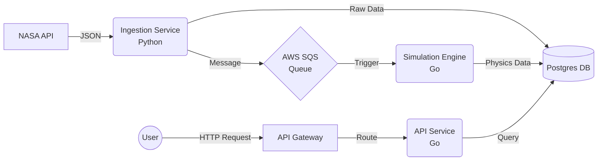

# NASA Asteroid Tracker

### A Cloud-Native Microservices Pipeline


## Overview
This project is a distributed microservices system that tracks Near-Earth Objects in real-time. It ingests data from NASA's API, calculates impact trajectories using a custom physics engine, and persists the data for analysis.

The system is containerized with Docker and orchestrated via Kubernetes, utilizing AWS SQS for asynchronous inter-service communication.

---

## Architecture
This project uses Event-Driven Architecture to decouple ingestion from processing.



| Database Verification |
| --------------------- | 


| Simulation Logs       |
| --------------------- | 


| API-Gateway           |
| --------------------- | 


## 🛠️ Installation & Setup

> **Note:** To run this project locally, you will need a NASA API Key and AWS Credentials (SQS access).

### 1. Prerequisites
* Docker Desktop & Kubernetes
* Go 1.24.0+ & Python 3.9+
* `kubectl` CLI tool

### 2. Environment Configuration
Create a `.env` file in the `services/ingestion-service` directory:
```ini
NASA_API_KEY=YOUR_KEY_HERE
AWS_ACCESS_KEY_ID=YOUR_AWS_KEY
AWS_SECRET_ACCESS_KEY=YOUR_AWS_SECRET
DB_CONNECTION_STRING=postgres://...
# Deploy all microservices to Kubernetes
kubectl apply -f infrastructure/k8s/


